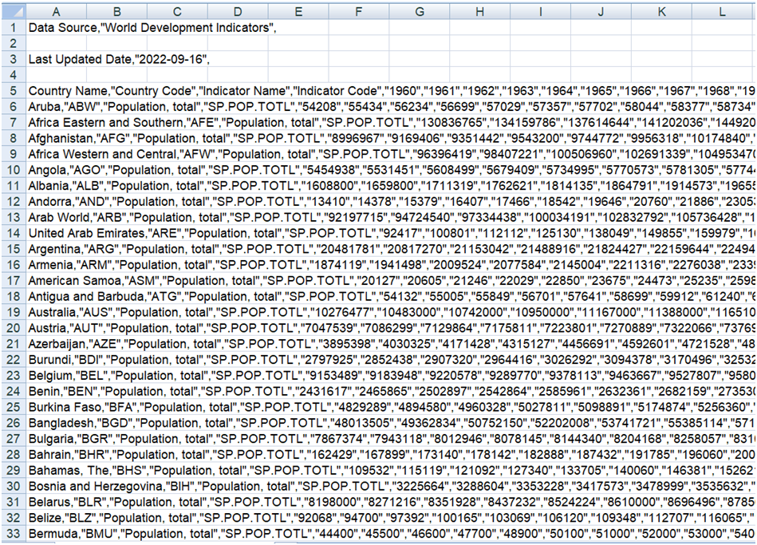

# 1. Źródła danych
https://www.worldometers.info/world-population/population-by-country/ \
https://data.worldbank.org/indicator/SP.POP.TOTL \
https://data.worldbank.org/indicator/SP.POP.TOTL.FE.ZS \
https://data.worldbank.org/indicator/SP.POP.65UP.TO.ZS \
https://data.worldbank.org/indicator/SP.POP.0014.TO.ZS \
https://data.worldbank.org/indicator/EN.POP.DNST?end=2020&start=1961&view=chart

# 2. Przygotowanie danych Python
   W celu uzyskania danych w pożądanym formacie do dalszej pracy w PostgreSQL sporządzono skrypt w języku Python 
   [przygotowanie_plikow_data_preparation]. W danych surowych każdy kraj posiadał kilkadziesiąt kolumn, zawierających 
   m.in. lata od 1960 do 2021 i wartości m.in. populacji, czy gęstości zaludnienia w danym roku. Skrypt umożliwił pozbycie niepotrzebnych kolumn oraz uporządkowanie danych w formacie: kraj, rok, wartość.

Dane surowe:

Dane uporządkowane:

# 3. Założenie bazy danych w PostgreSQL, utworzenie tabel oraz zaimportowanie do nich danych w formacie csv
[TworzenieBazy_CreatingDatabase]

# 4. Problemy z danymi
+ Nazwy krajów z tabel ze strony worldbank.org w niektórych przypadkach różnią się od nazw w tabeli ze strony worldometers.info, co utrudnia ich łączenie.
+ Nazwy krajów z tabel ze strony worldbank.org zawierają również regiony, np. Europe & Central Asia, OECD members, High income, których należy się pozbyć.
+ Populacja poszczególnych krajów na 2020 rok ze strony worldometers.info nieznacznie różni się od danych z worldbank.org w 2020 roku.

# 5. Sposób rozwiązania problemów poprzez łączenie i utworzenie dwóch finalnych tabel przy pomocy zapytań SQL
[Zapytania_Queries]

# 6. Analizy na zbiorze danych
[Zapytania_Queries]

[przygotowanie_plikow_data_preparation]: przygotowanie_plikow_data_preparation.py
[TworzenieBazy_CreatingDatabase]: TworzenieBazy_CreatingDatabase.sql
[Zapytania_Queries]: Zapytania_Queries.sql